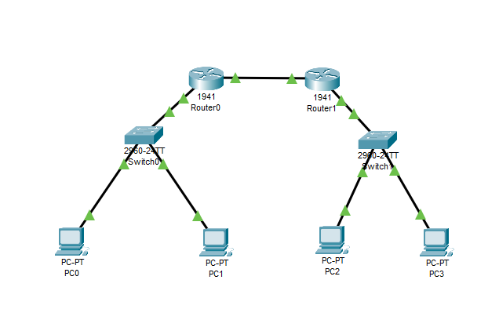

# Exercício 4
## Sobre o projeto:
Esse projeto tem como objetivo simular um ambiente onde dois roteador foram utilizados para ligar duas redes. 
## Exercício utilizado para a criação do projeto:
+ 2 Roteadores 1941
+ Conectados através da Gigabit 0/0
+ 2 Switchs 2960
+ 4 pcs
+ Rede 192.168.0.0
+ PC0 - 192.168.0.1 - 255.255.255.192 Gateway 192.168.0.62
+ PC1 - 192.168.0.2 - 255.255.255.192 Gateway 192.168.0.62
+ Rede 192.168.0.64
+ Router0
+ Gigabit 0/0 - 192.168.0.62 - 255.255.255.192
+ Gigabit 0/1 - 192.168.0.65 - 255.255.255.192
+ Router1
+ Gigabit 0/0 - 192.168.0.190 - 255.255.255.192
+ Gigabit 0/1 - 192.168.0.66 - 255.255.255.192
+ Rede 192.168.0.128
+ PC2 - 192.168.0.129 - 255.255.255.192 Gateway 192.168.0.190
+ PC3 - 192.168.0.130 - 255.255.255.192 Gateway 192.168.0.190
## Tecnologias utilizadas:
O projeto utiliza o Cisco Packet Tracer. 

## Principais funcionalidades:
Simular um ambiente onde dois roteadores conectam duas redes. \
!

